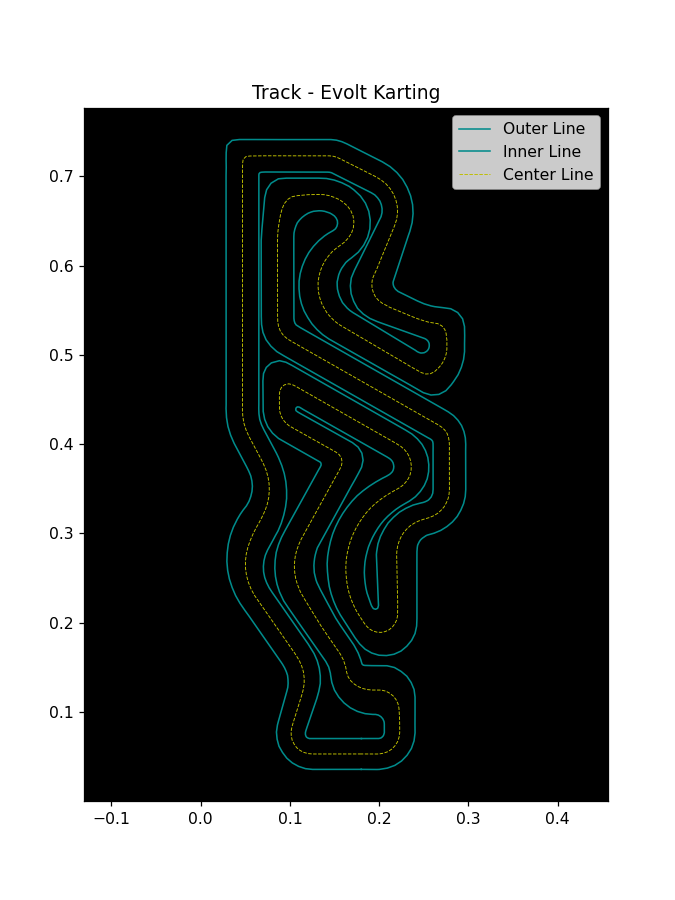
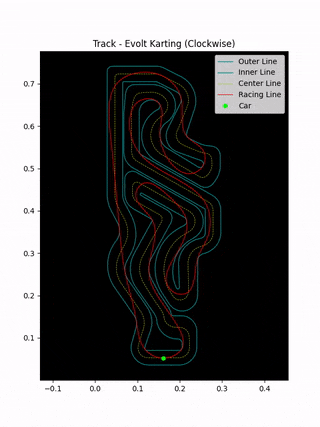
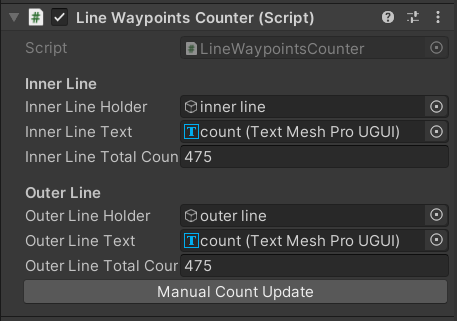
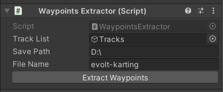
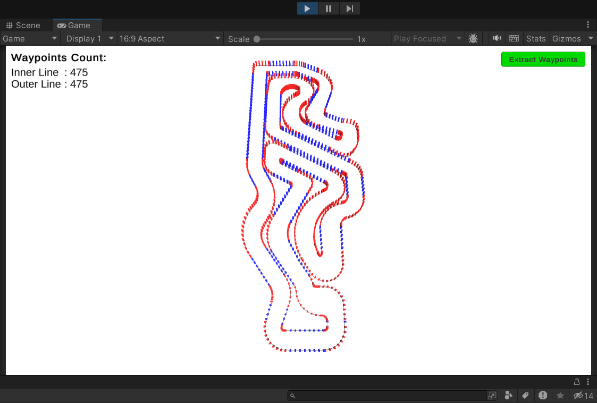
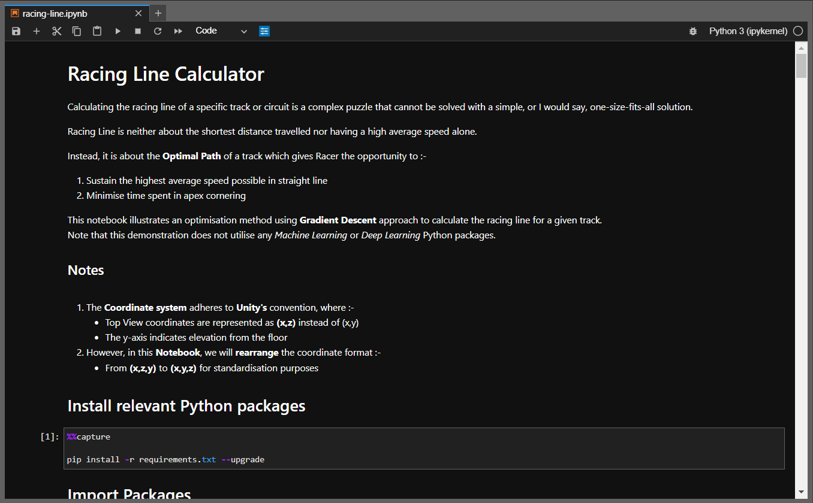

![Preview Mode][mode-preview]

# TechTrack - Z

![TechTrack-Z Logo][main-logo]

<strong><i>Welcome to TechTrack-Z, the ultimate destination for racing enthusiasts and aspiring racers!</i></strong>

---

  ![Python Version][version-python]
  ![Unity Version][version-unity]

  ![Windows Version][version-windows]
  ![WSL2 Version][version-wsl2]

  ![CPU Version][version-cpu]
  ![GPU Version][version-gpu]

---

  [![MIT License][license-mit]][license-mit-url]

---

**TechTrack-Z**, or *TechTrack with Zaim*, is an exciting educational series where we embark on a mission to discover the theoretical optimal racing lines for various tracks and circuits all around the globe. Whether it's the twists and turns of Go-Karting tracks, high-speed challenges of Race Car circuits, or the adrenaline-pumping Motorcycle racing paths, this series is dedicated to unraveling the secrets of these tracks.

---

## Motivation :pushpin:
TechTrack-Z is to empower racers, from beginners to seasoned professionals, with the racing line knowledge they need to enhance their skills and master the art of racing. We believe that understanding the nuances of each track is key to achieving excellence, and we are committed to sharing this knowledge with the racing community.

---

## Theoretical Racing Line :pushpin:
_Expand any track / circuit names under the "Track List" below to read its respective details..._
<table>
    <tr>
        <th>Country</th>
        <th>Track List</th>
    </tr>
    <tr>
        <td><b>Malaysia</b></td>
        <td>
            

            
<em>Evolt Karting</em>

            <ul>
                <table>
                    <tr>
                        <th>Track Layout</th>
                        <th>Racing Line</th>
                        <th>Track Info</th>
                    </tr>
                    <tr>
                        <td>
                            
                        </td>
                        <td>
                            
                        </td>
                        <td>
                            <ul>
                            <li>
                                <table>
                                    <tr>
                                        <th colspan="2">Details</th>
                                    </tr>
                                    <tr>
                                        <td>Track Name</td>
                                        <td><b>Evolt Karting</b></td>
                                    </tr>
                                    <tr>
                                        <td>Track Type</td>
                                        <td>Indoor</td>
                                    </tr>
                                    <tr>
                                        <td>Kart Type</td>
                                        <td>Electric-Powered</td>
                                    </tr>
                                </table>
                            </li>
                            <li>
                                <table>
                                    <tr>
                                        <th colspan="2">Venue</th>
                                    </tr>
                                    <tr>
                                        <td>Location</td>
                                        <td>Shah Alam, Selangor</td>
                                    </tr>
                                    <tr>
                                        <td>Google Maps</td>
<td>

[View in Maps][evolt-karting-google-maps]

</td>
                                    </tr>
                                </table>
                            <li>
                                <table>
                                    <tr>
                                        <th>Social Media</th>
                                    </tr>
                                    <tr>
                                        <td>
                                            <ul>
<li>

  [Instagram][evolt-karting-instagram]

</li>
<li>

  [Facebook][evolt-karting-facebook]

</li>
<li>

  [Website][evolt-karting-website]

</li>
                                            </ul>
                                        </td>
                                    </tr>
                                </table>
                            </li>
                        </td>
                    </tr>
                </table>
            </ul>
            

        </td>
    </tr>
</table>

---

## Methodology :pushpin:
<table>
    <tr>
        <th>Objective</th>
        <th>Tool</th>
        <th>Snippets</th>
    </tr>
    <tr>
        <td>To map waypoints of a given track based on its image layout alone, in a real-world space.</td>
        <td>Unity Game Engine</td>
        <td>
            <ul>
                <li><b>Helper Scripts</b>
                    <ul>
                        <li>
                            Waypoints Counter  
                            
                        </li>
                        <li>
                            Waypoints Extractor  
                            
                        </li>
                    </ul>
                </li>
                <li><b>Waypoints Mapper</b>
                    <ul>
                        <li>
                            Plotted the waypoints in the 3D World Space for the real-space accuracy and precision.  
                            
                        </li>
                    </ul>
                </li>
            </ul>
        </td>
    </tr>
    <tr>
        <td>To calculate optimal Racing Line of a given track.</td>
        <td>JupyterLab with Python (Anaconda)</td>
        <td>
            <ul>
                <li><b>JupyterLab Notebook</b>
                    <ul>
                        <li>
                            Implemented logics through Python.   
                            
                        </li>
                    </ul>
                </li>
            </ul>
        </td>
    </tr>
</table>

---

## Join Us on the Journey :pushpin:
Whether you're a passionate racer, a curious enthusiast, or someone just starting their racing journey, TechTrack-Z welcomes you to join us in the pursuit of racing perfection.

Want to reach out? Have got lists of waypoints? 
Suit up and hit the button below!  
[![Gmail][gmail]][gmail-mailto]

---

## License :pushpin:
This project is licensed under MIT License. 
 
You are welcome to use the codes for anything you want. Feel free to modify, share, and distribute it. However, please be aware that there is no warranty and we are not responsible for any issues that might occur. 
 
If you use the codes and other image resources, a little shout-out attribution to me acknowledging the source, would be great. Happy coding! :tada:

<!-- REFERENCES -->
<!-- MODE -->
[mode-preview]: https://img.shields.io/badge/Mode-Preview-ff8700

<!-- README LOGO -->
[main-logo]: ./README_Data/TechTrackZ_Logo.png

<!-- SPECIFICATIONS -->
[version-python]: https://img.shields.io/badge/Python-3.11.4-00d2be?logo=python&logoColor=white
[version-unity]: https://img.shields.io/badge/Unity-2022.3.7f1_LTS-2b4562?logo=unity&logoColor=white
[version-windows]: https://img.shields.io/badge/Windows-11-0090ff?logo=windows11&logoColor=white
[version-wsl2]: https://img.shields.io/badge/WSL_2-Ubuntu_20.04.6_LTS-dc0000?logo=ubuntu&logoColor=white
[version-cpu]: https://img.shields.io/badge/CPU-AMD_Ryzen_9_5900X-900000?logo=amd&logoColor=white
[version-gpu]: https://img.shields.io/badge/GPU-Nvidia_RTX_3080-006f62?logo=nvidia&logoColor=white

<!-- EMAIL -->
[gmail]: https://img.shields.io/badge/Email_Us!-white?logo=gmail
[gmail-mailto]: mailto:zaim.zazali@gmail.com?subject=🔴%20[GitHub]%20-%20TechTrack-Z%20Inquiry

<!-- LICENSE -->
[license-mit]: https://img.shields.io/badge/License-MIT-0600ef?logo=superuser&logoColor=white
[license-mit-url]: https://github.com/zaimzazali/TechTrack-Z_Preview/blob/main/LICENSE

<!-- UNITY -->
[unity-overview]: ./README_Data/Unity_Overview.png
[unity-waypoints-counter]: ./README_Data/Unity_Line-Waypoints-Counter.png
[unity-waypoints-extractor]: ./README_Data/Unity_Waypoints-Extractor.png

<!-- Notebook -->
[jupyterlab-notebook-image]: ./README_Data/Notebook.png
[jupyterlab-notebook-preview]: ./Main/TechTrack-Z/evolt-karting/racing-line_preview.ipynb

<!-- TRACKS & RACING LINE -->
<!-- Evolt Karting -->
[evolt-karting-google-maps]: https://maps.app.goo.gl/8bUGDWCJnZNRdCe89

[evolt-karting-instagram]: https://www.instagram.com/evoltkarting
[evolt-karting-facebook]: https://www.facebook.com/evoltkarting
[evolt-karting-website]: https://www.evoltkarting.com

[evolt-karting-track-layout]: ./Main/TechTrack-Z/evolt-karting/data/track_layout.png
[evolt-karting-racing-line]: ./Main/TechTrack-Z/evolt-karting/data/animated_racing_line.gif